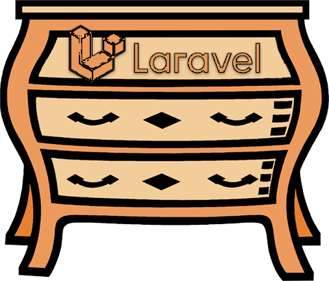

# Laravel-module



*** 
Light package based in package archived: https://github.com/ferrl/framework

The objective is, transform your code in simple modules

Require: PHP >= 7.2.5


Step for setup:

* ```composer require havennow\laravel-module```
* ```php artisan vendor:publish --provider="Havennow\LaravelModule\ModuleProvider" --tag=config```
* see in config/modules.ph configs

***

### Configuration

* in array you can enable in general or disable via ENV in ```.env``` file : ```LARAVEL_MODULE_ENABLE```, is bool
* you can enable specify module ```1 => ['name' => 'XPTO', 'enable' => true ]```
* the index in array need be integer, for order load, in case one module load before another
* for default the folder is `app/Modules`,  and namespace ```App\Modules```


### How-use

* Put the ServiceProvider in config/app.php ```\Havennow\LaravelModule\ModuleServiceProvider::class``` in providers section
* in console ```php artisan laravel-module:make-module Example```
* enable in config in ```'available' => [``` add ```1 => ['name' => 'example', 'enable' => true ]```
* see the code into Modules path
* Test example in ```http://localhost/test```


Can custom abstract class for Module
for example, you can disable the module in runtime

````
class Module extends ModuleAbstract 
{

    public function loadBefore()
    {
        $this->setEnable(false);
    }
